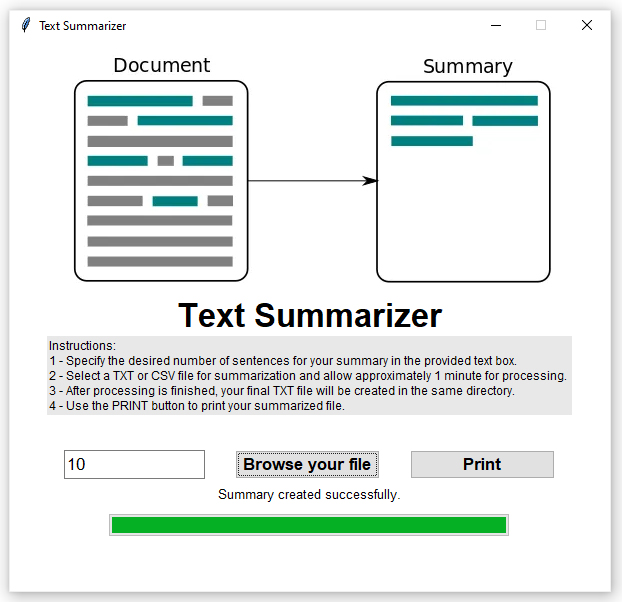

# Text Summarizer Application

This application provides a user-friendly interface for summarizing text documents. It utilizes natural language processing techniques to generate concise summaries from input text files.

## Installation

To install the required dependencies, run the following command:

```bash
pip install -r requirements.txt

# Usage

## Run the Application
Execute the `main.py` file to launch the text summarizer application.

## Interface Overview
Upon launching the application, you will see the main window containing the following elements:

- **Input box:** Enter the desired number of sentences for the summary.
- **Browse button:** Select a text file for summarization.
- **Print button:** Print the summarized text.
- **Progress bar:** Displays the progress of file processing and summarization.

## Instructions
1. Specify the desired number of sentences for the summary in the provided text box.
2. Select a TXT or CSV file for summarization and allow approximately 1 minute for processing.
3. After processing is finished, your final TXT file will be created in the same directory.
4. Use the PRINT button to print your summarized file.

# Dependencies
- nltk: 3.8.1
- numpy: 1.23.5
- pandas: 1.5.3
- networkx: 3.1
- scikit-learn: 1.2.2
- customtkinter: 5.2.1
- Download and replace the [glove.6B.100d.txt] file from the below link and put it in the App directory. (https://nlp.stanford.edu/data/glove.6B.zip)

# Screenshots
You can find screenshots of the application in the screenshots folder.

To add a picture from the `screenshots` folder, you can use Markdown syntax like this:


Replace `screenshot.png` with the actual filename of your screenshot.

# License
This project is licensed under the MIT License. See the LICENSE file for details.
